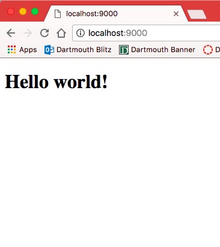
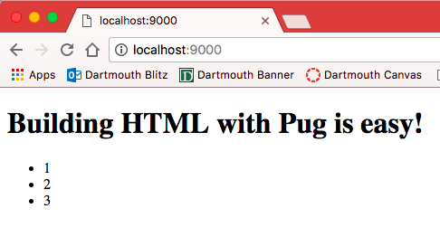
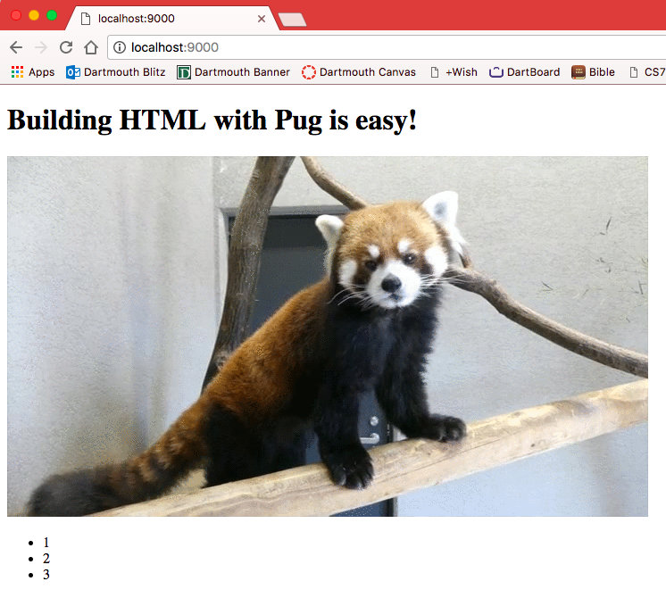
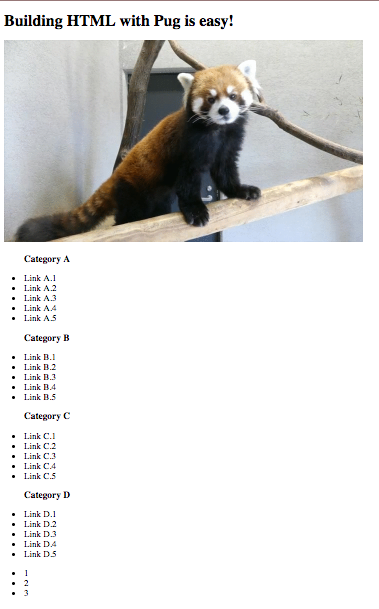

# Pug Workshop

[Pug](https://pugjs.org/), formerly known as Jade, is a preprocessor for HTML and a Node.js templating engine implemented with Javascript. It is the number one

## Instructions
To complete this workshop, follow the following steps:

1. [Fork the repository](#fork-the-repo)
2. [Install pug](#install-pug)
3. [Start a pug file](#start-a-pug-file)
4. [Serve your first project](#serving-your-project-on-a-browser)
5. [Spice up your website](#spice-up-your-website)
6. [Variables and Conditionals](#adding-variables-and-conditionals)
7. [Let's add a navbar](#add-a-navbar)
8. [Build the sitemap](#building-the-sitemap)
9. [Style the site](#style-your-webpage)

Be sure to look out for the following notations:
* :computer: run in terminal
* :rocket: this is a key step

## Fork the Repo
:rocket: First, make sure to fork [this](http://...) repo and clone it to your computer so we can get started!


## Install Pug
Then, in your new repository, install Pug. We will be working with [Pug's CLI interface](https://www.npmjs.com/package/pug-cli) so that we can run the files without a server.
:computer:
```
npm install pug-cli -g
```
This installs the package globally so the node-modules file is no longer needed.

## Start a Pug File
We will be working in a .pug file, so let's create the file in templates.
:computer:
```
touch index.pug
atom index.pug
```
One of the main advantages of using Pug is that the syntax is very clean and simple. Rather than dealing with the XML styling of HTML with all the tags, we can simply write p or h1 to specify how to format the content.

Let's start with a very simple Hello World!

:rocket: Start with the beginning header to the pug file. It is like an html file, but simpler (no closing tags are needed).
```
doctype html
html
  head
  body
```

Now, you can add in Hello World to your body!

:rocket:
```
h1 Hello world!
```

## Serving your project on a browser
With the new pug file, we can now render it into an HTML file and host it locally to see our work so far. It is very simple to render our pug file into an HTML file.
:computer:
```
pug -P -w index.pug
```
The -P tag will format the HTML file to include whitespaces while the -w tag allows for automatic re-rendering every time you update your index.pug file. Take a look at your new html file, which should be called index.html.

:computer:
Then, to host it locally, paste the line that we have been using.
```
python -m SimpleHTTPServer 9000
```
Visit http://localhost:9000/ and there you have it!
Your site should look something like this:




## Spice up your website
Let's make our website more interesting. Instead of having Hello World, let's change this to be a callout. In Pug, if there are no specified tags, it is assumed that you are creating a div. First, create a div with the class as main and under that div, let's create a div with class callout. To write classes and IDs, we write it the same way as in a css file, .class and #ID.

:rocket: Add this to your body.
```
.main
  .callout
    h1 Building HTML with Pug is easy!
```

:rocket: Next, try adding a footer as an unordered list with three items. To do so, use the footer tag, the ul tag, and the li tag.
```
.footer
  ul
    li 1
    li 2
    li 3
```
Your page should look like this:



## Adding variables and conditionals

One of the cool things about using Pug is that we can add in conditionals. Inside your pug file, you can add in if else statements in addition to using variables. If you look at the options.js file that we have given you, we have a variable happy that has a boolean as a value. Now, we can use this so that if happy, we display one image, or else, a different image.

:rocket: Try adding this to your callout under h1.
```
if happy
  img(src="https://i.imgur.com/AV83fzb.gif")
else
  img(src="https://i.imgur.com/rG0fW29.gif")
```
Since we are now using the javascript file that stores all the variables and data, we want to add a tag when we render our HTML file so that it knows to look at the javascript file to look for data. Similar to what we have been doing, we just need to add an options switch.

:computer:
```
pug -P -O options.js templates/index.pug
```

Your page should now look like this:



:rocket: Now go into options.js and change happy to true and reload your page.

## Add a navbar
Another advantage of using pug is that you can use other templates that you have created and just put it into your pug file! You may have noticed that in your templates folder, there is another pug file, navigation.pug. This file has the navigation template that we have created for you.

:rocket: Add this navigation template above your callout div.
```
include navigation.pug
```
Right now, your nav bar only has a list. How about adding a logo? Adding images to your webpage is really easy with pug.

:rocket: Add this above the unordered list in your navigation file.
```
img(src="img/icon")
```

## Building the sitemap
Like what we did in our first lab, we will be creating some headers and links. Unlike writing everything out in HTML over and over again like we did in Lab 1, with Pug, we can just iterate through a list.

In your options.js file, we have given you some data that you will be using in this next section. We have given you a list, sitemap, that has some headers and links for each category.

By iterating through the sitemap, we can create an unordered list for each category so that the list starts with a header and then has the links that go with each header. It should look similar to what you had for Lab 1.

:rocket: Create a new div with the class sitemap after your callout div and go through each item in the list sitemap, extracting the header and then looping through the links.  

```
.sitemap
  each category in sitemap
    ul
      h3= category.header
      each link in category.links
        li= link
```

Your page should look something like this:



:rocket: Go into your options.js and try changing around the variables. Then re-render your html and host your site to see your changes!


## Style your webpage
Finally, let's add some styling to the site!! We have given you a CSS file; all you have to do is link it to your pug file! First, let's link a font from google fonts.

:rocket: At the top of your pug file under head, link in your fonts and css.

```
link(rel='stylesheet', href='styles.css')
link(href='https://fonts.googleapis.com/css?family=Amatic+SC:400,700', rel='stylesheet')
```

And there you have it!


### Order of readme

1. Build simple Hello world! in the body
2. Change Hello World! to main div and a callout (assumes things are divs if you don’t specify) (create a div called callout) (h1, p)
3. Run pug -P -w templates/index.pug
4. create footer with list (ul)
5.  add nav bar (include nav.pug) see how you can pull in other templates. add in an image to the nav bar before the ul
6. spice up callout (add if else statement)
7. build sitemap with
8. run pug -P -w options.js tempaltes/index.pug
9. change variables in js (from false to true for happy and other list variables)
10. link stylesheet and voila!
